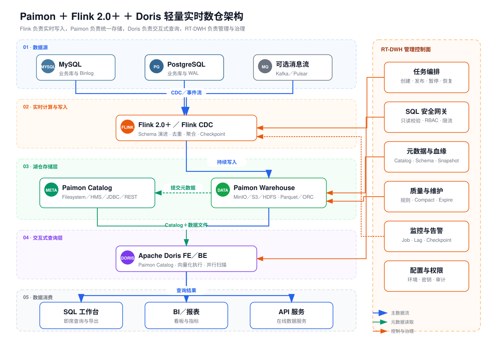

# RT-DWH Management Platform

面向中小团队的轻量实时数仓管理平台：**Flink 负责实时写入，Paimon 负责湖仓存储，Doris 负责交互式查询，RT-DWH 负责统一管理。**



## 目录

- [项目定位](#项目定位)
- [核心架构](#核心架构)
- [产品能力](#产品能力)
- [未完成能力](#未完成能力)
- [技术栈](#技术栈)
- [快速开始](#快速开始)
- [本地开发](#本地开发)
- [配置说明](#配置说明)
- [构建与验证](#构建与验证)
- [生产部署注意事项](#生产部署注意事项)
- [项目结构](#项目结构)
- [文档与图示](#文档与图示)
- [常见问题](#常见问题)

## 项目定位

RT-DWH 将实时数据接入、湖仓元数据、交互式查询、数据质量和任务运维收敛到一个管理入口，目标是在没有专职大数据平台团队的情况下，也能搭建和维护一套可用的实时数仓。

平台重点解决六类问题：

- **数据接入**：通过 Flink CDC 将 MySQL 等业务数据持续写入 Paimon。
- **数据管理**：同步 Paimon Catalog、Schema、Snapshot 和 ODS／DWD／DWS／ADS 分层元数据。
- **数据查询**：通过 Doris Paimon External Catalog 执行即席查询，不让交互式查询与 Flink CDC Job 争抢 Slot。
- **稳定运行**：管理 Flink Job 的提交、暂停、恢复、停止、Savepoint 和状态自动校准。
- **质量治理**：执行质量规则、表维护、健康检查和多通道告警。
- **平台管控**：统一权限、操作审计、查询配额、运行参数和依赖健康状态。

适合：

- 中小规模实时数仓、数据中台验证和湖仓方案原型；
- 希望用一套页面管理 Flink、Paimon 与 Doris 的工程团队；
- 需要从单机 Compose 起步，再逐步迁移到共享存储和集群部署的项目。

当前边界：

- 默认 Flink 镜像已内置 MySQL／PostgreSQL CDC、Paimon、MySQL JDBC 和 Hadoop 依赖；PostgreSQL CDC 启动前会自动执行 logical replication 权限与 Slot 容量预检。
- Doris 对 Paimon 的定位是只读查询；写入、Compact、Snapshot 清理等操作仍由 Flink／Paimon 完成。
- Compose 使用本地共享卷演示 Paimon Warehouse，只适合单机开发；生产环境必须使用所有 Flink、Doris 节点可访问的共享存储。
- Helm Chart 可部署管理平台前后端，依赖外部 MySQL、Flink、Doris、共享存储和镜像仓库，不负责安装数据基础设施。

## 核心架构

### 写入链路

```text
MySQL／PostgreSQL
        │ CDC
        ▼
Flink 2.2 + Flink CDC
        │ 流式写入
        ▼
Paimon Catalog + Paimon Warehouse
```

Flink 负责 Schema 探测、CDC SQL 生成、Checkpoint、Savepoint 和持续写入。Paimon 使用 MySQL JDBC Catalog 保存元数据，数据文件写入 Warehouse。

### 查询链路

```text
SQL 工作台／报表／API
        │
        ▼
RT-DWH 查询服务
  ├─ 只读 SQL 校验
  ├─ RBAC、超时、行数限制
  └─ 历史、取消、Trace ID
        │ Doris MySQL 协议
        ▼
Doris FE／BE
        │ Paimon External Catalog
        ▼
Paimon Catalog + Warehouse
```

Doris 负责 Paimon 数据的交互式查询。后端启动时可自动创建 `rtdwh_paimon` Catalog，并通过 Doris 动态读取 Database、Table 和 Column，驱动前端 Catalog 树与 SQL 智能提示。

### 管理控制面

RT-DWH 后端通过 Flink REST API、Flink SQL Gateway、Doris MySQL 协议和 Paimon JDBC Metastore 统一管理依赖组件，同时把运行状态持久化到 MySQL。

| 组件 | 主要职责 |
|---|---|
| RT-DWH Frontend | 数据总览、任务、元数据、查询、质量、告警和设置页面 |
| RT-DWH Backend | API、权限、任务编排、状态监控、查询网关和系统配置 |
| Flink JobManager／TaskManager | CDC、流式计算、Checkpoint 与 Savepoint |
| Flink SQL Gateway | 执行生成的 CDC／Paimon SQL 和维护语句 |
| Paimon | Catalog、Schema、Snapshot 与湖仓数据文件 |
| Doris FE／BE | Paimon Catalog 发现、SQL 解析与分布式查询 |
| MySQL | 管理库、Quartz 表和 Paimon JDBC Catalog |

## 产品能力

RT-DWH 不是 Flink、Paimon 或 Doris 的替代品，而是位于三者之上的实时数仓控制面。平台围绕“数据进入湖仓以后，如何持续运行、被发现、被查询、被治理”组织产品能力。

### 产品角色

| 角色 | 主要诉求 | 平台入口 |
|---|---|---|
| 数据工程师 | 接入业务库、创建 CDC／ETL 任务、处理失败和补数 | 数据源、同步任务、任务编排 |
| 数据开发／分析师 | 查找数据资产、编写 SQL、复用查询并制作报表 | 表管理、即席查询、报表看板 |
| 数据治理／运维人员 | 管理质量规则、血缘、生命周期、告警和组件健康 | 数据质量、数据血缘、湖仓维护、系统设置 |
| 平台管理员 | 管理账号权限、运行参数、密钥和操作审计 | 用户权限、系统设置、操作审计 |

### 能力全景

| 产品域 | 核心价值 | 已实现能力 |
|---|---|---|
| 数据接入 | 让业务数据稳定、持续地进入湖仓 | MySQL／PostgreSQL 数据源管理、连通性测试、Schema 探测、表映射、全量＋增量与增量启动模式、CDC SQL 预览 |
| 实时开发与编排 | 让流任务能够发布、恢复、补数和追踪 | Flink Job 生命周期、Checkpoint／Savepoint、失败重试、运行指标、DAG 依赖、环路校验、任务版本、回滚和按业务日期补数 |
| 湖仓资产管理 | 让 Paimon 中的数据可发现、可理解、可维护 | Catalog 元数据同步、数仓分层、Schema／Snapshot、主键与分区、责任人／业务域／标签／敏感级别、Compact 与快照清理 |
| 查询与数据服务 | 让湖仓数据可低延迟查询并服务分析场景 | Doris 加速 Paimon、SQL 工作台、Catalog 智能提示、查询取消／历史／收藏／导出、报表配置和数据看板 |
| 质量与可观测性 | 让数据异常和运行故障能够被发现、定位和处置 | 质量规则、定时检查、运行批次、任务与组件指标、依赖健康快照、钉钉／企业微信／邮件告警、告警闭环 |
| 安全与平台管控 | 让多人协作有边界、变更有记录、资源有约束 | JWT、接口级 RBAC、三类内置角色、密码加密、写操作审计、查询并发配额、Workload Group 和运行参数管理 |

### 1. 数据接入

平台以“数据源—源表—目标分层表—同步任务”为核心模型，把连接配置和 CDC 作业配置分离：

- 管理 MySQL、PostgreSQL 和 Paimon 数据源，提供连通性测试与表结构探测；
- 选择源表并映射到 Paimon Database／Table，支持 ODS 等目标分层；
- 根据源表字段、主键和数据库类型自动生成 Flink CDC SQL；
- 支持首次全量后持续增量，以及从最新位点开始的纯增量模式；
- 在提交前预览 SQL、启动模式、并行度和 Checkpoint 参数，降低黑盒配置风险。

默认 Flink 镜像同时内置与 Flink 2.2 匹配的 MySQL CDC、PostgreSQL CDC 和 Paimon Connector；Compose 中的 MySQL 已启用 ROW Binlog，PostgreSQL 已启用 logical replication。

### 2. 实时开发与任务编排

平台统一管理持续运行的 CDC Job 和按实例运行的 ETL／物化任务：

- CDC Job 支持启动、停止、暂停、恢复、重试和手动 Savepoint；
- 采集 Job 状态、Checkpoint、Lag 与吞吐量，并校准 `NOT_FOUND`、`SUSPENDED` 和集群不可达等状态；
- 配置上下游依赖并执行 DAG 环路校验；
- 发布任务配置版本、查看历史版本并回滚到 draft；
- ETL／物化任务可按业务日期创建补数实例，由内置 Flink SQL Runner 自动领取、提交和回写结果；
- 运行实例具备 Job ID、租约、心跳、超时回收、指数退避重试、取消和人工重跑；
- 调度器在上游同业务日期实例成功后，自动释放下游等待实例。

CDC 是常驻流任务，不参与按日期补数；除内置 Flink SQL Runner 外，外部执行器仍可通过领取、心跳、关联 Job 和完成接口接入 Doris SQL、Spark 或 Python Runner。

### 3. 湖仓资产管理

平台将 Paimon 的物理元数据与数仓治理属性组合成可运营的数据资产：

- 同步 JDBC Catalog 中的 Database、Table、Column、主键、分区键和表选项；
- 识别 ODS／DWD／DWS／ADS 分层，查看 Schema、Snapshot、文件量和数据规模；
- 维护表责任人、业务域、标签、敏感级别、业务描述和生命周期状态；
- 展示由同步映射、任务依赖和 SQL 解析形成的真实数据血缘；
- 执行单表或批量 Compact、Expire Snapshots、Orphan Files Cleanup，并记录维护日志。

### 4. 查询与数据服务

查询链路使用 Doris 读取 Paimon，避免交互式查询占用 Flink CDC 的计算资源：

- 自动初始化 Doris Paimon External Catalog，并关闭 Paimon table-object 缓存以读取最新 Snapshot；
- 浏览 Catalog／Database／Table／Column，使用 Monaco SQL 编辑器和上下文智能补全；
- 执行只读 SQL 校验、超时控制、最大行数限制、结果截断和用户并发限制；
- 支持查询取消、CSV 导出、服务端／浏览器 SQL 收藏和查询历史；
- 记录执行引擎、Catalog、Database、Trace ID、耗时、状态和错误信息；
- 汇总成功率、P95 耗时、失败查询和并发使用情况；
- 基于 SQL 模板配置表格、折线、柱状、饼图和混合图报表，形成业务看板。

这里的“实时可见”由两部分组成：Flink 在 Checkpoint 时提交 Paimon Snapshot，Doris 查询最新 Snapshot。端到端可见延迟通常不超过一个 Checkpoint 周期加查询时间。

### 5. 数据质量与可观测性

平台把规则执行、异常发现、通知和处置组织成治理闭环：

- 提供空值率、唯一性、范围、行数和自定义 SQL 等质量规则；
- 通过 Doris 定时执行质量检查，保留批次与规则级运行记录；
- 汇总 Flink Job、Checkpoint、Lag、吞吐和 MySQL／Paimon／Doris 组件健康；
- 持久化健康快照，区分数据异常、任务异常和基础组件异常；
- 通过钉钉、企业微信和邮件发送通知；
- 自动评估任务失败、数据延迟和质量异常规则，按故障对象去重；
- 指标恢复后自动关闭告警并发送恢复通知，记录通知状态；
- 支持告警确认、解决和处置状态跟踪。

### 6. 安全与平台管控

- 使用 JWT 鉴权和接口级 RBAC，内置 `ADMIN`、`DEVELOPER`、`VISITOR` 三类角色；
- 对数据源密码进行加密存储，生产环境要求配置稳定的加密密钥；
- 对非只读接口记录操作人、资源、请求结果和错误信息；
- 对即席查询设置单用户并发上限、单查询内存和 Workload Group；
- 在系统设置中维护 Flink、Doris 等运行参数并执行连接测试；
- 统一返回业务错误、Trace ID 和依赖健康信息，便于问题定位。

### 典型产品闭环

1. **接入闭环**：创建数据源 → 探测源表 → 配置映射 → 预览 CDC SQL → 启动作业 → 观察 Checkpoint 和 Lag。
2. **分析闭环**：发现 Paimon 表 → 在 SQL 工作台验证口径 → 收藏 SQL → 配置报表 → 加入数据看板。
3. **治理闭环**：补充表责任人和业务标签 → 配置质量规则 → 定时执行 → 异常告警 → 确认并处置。
4. **恢复闭环**：发现任务异常 → 查看运行状态和日志 → Savepoint／重试 → 状态自动校准 → 验证下游数据。
5. **变更闭环**：调整任务配置 → 发布版本 → 检查 DAG → 运行或补数 → 必要时回滚 draft → 审计变更记录。

## 未完成能力

核心交付闭环和首批 P1 能力已经落地，后续工作集中在更细粒度的数据权限、分发订阅和成本归因：

| 优先级 | 近期重点 |
|---|---|
| P1 | PostgreSQL Slot 生命周期、Doris 运行指标/Profile、报表计划/快照/订阅通知、用户角色管理和可渲染 Helm Chart 已完成首版；继续补充数据域权限、查询排队与成本预算、参数化报表和最小集群安装验收 |
| P2 | 建设列级血缘与脱敏、统一指标与数据产品、SLA／成本看板和变更审批流程 |

各项现状、缺口和验收标准见 [`docs/product-roadmap.md`](docs/product-roadmap.md)。

## 技术栈

| 层 | 技术 | 当前项目版本／配置 |
|---|---|---|
| 后端 | Spring Boot、Undertow、JPA、Security、Quartz | Spring Boot 3.3、Java 17 |
| 前端 | Umi Max、Ant Design、ProComponents、Monaco Editor | Umi 4.4、React 18、Ant Design 5 |
| 实时计算 | Apache Flink、Flink CDC | Flink 2.2.1、MySQL／PostgreSQL CDC 3.6.0-2.2 |
| 湖仓 | Apache Paimon | Paimon 2.0.0、JDBC Catalog |
| 查询 | Apache Doris | Doris 4.1.3、Paimon External Catalog |
| 管理数据库 | MySQL、Druid | MySQL 8.0、Druid 1.2.23 |
| 部署 | Docker Compose、Helm | Compose 为默认开发方式，Helm 部署前后端并接入外部基础设施 |
| 可观测性 | Spring Boot Actuator、Prometheus、Grafana | Prometheus 2.52、Grafana 11，可选启用 |

> Doris 4.1 的 Paimon JDBC Catalog 仍属于实验能力。升级 Paimon 或 Doris 时，应先验证 Catalog、主键表、Deletion Vector、Schema Evolution 和复杂类型兼容性。参见 [Apache Doris Paimon Catalog 文档](https://doris.apache.org/docs/4.x/lakehouse/catalogs/paimon-catalog/)。

## 快速开始

### 1. 前置条件

- Docker Engine 或 Docker Desktop；
- Docker Compose v2；
- Git；
- 能够访问 Maven Central 和 Docker Hub，用于首次构建 Flink 镜像及拉取依赖；
- 为 Flink、Doris 和 MySQL 预留足够的本机 CPU、内存与磁盘空间。

本地 Java／Node.js 只在源码开发时需要，纯 Compose 启动不要求预先安装。

### 2. 配置环境变量

```bash
git clone <repo-url> rt-dwh-mgmt
cd rt-dwh-mgmt
cp deploy/.env.example deploy/.env
```

至少填写以下变量：

```dotenv
MYSQL_ROOT_PASSWORD=<MySQL root 密码>
MYSQL_PASSWORD=<rtdwh_admin 密码>
DB_PASSWORD=<与 MYSQL_PASSWORD 相同>
PAIMON_JDBC_PASSWORD=<与 MYSQL_PASSWORD 相同>

JWT_SECRET=<至少 32 个字符的随机密钥>
ENCRYPTION_KEY=<数据源密码加密密钥>

INIT_USERS_ENABLED=true
INIT_ADMIN_PASSWORD=<管理员初始密码>
INIT_DEV_PASSWORD=<开发者初始密码>
INIT_GUEST_PASSWORD=<访客初始密码>
```

默认 Compose 让管理库和 Paimon JDBC Catalog 共用 `rtdwh_admin` 用户，因此 `MYSQL_PASSWORD`、`DB_PASSWORD`、`PAIMON_JDBC_PASSWORD` 应保持一致。

### 3. 启动服务

```bash
docker compose --env-file deploy/.env -f deploy/docker-compose.yml up -d --build
```

查看状态和日志：

```bash
docker compose --env-file deploy/.env -f deploy/docker-compose.yml ps
docker compose --env-file deploy/.env -f deploy/docker-compose.yml logs -f rtdwh-backend
```

### 4. 访问地址

| 服务 | 地址 | 说明 |
|---|---|---|
| RT-DWH Web | `http://localhost` | 管理平台入口 |
| RT-DWH API | `http://localhost/api/v1` | Nginx 对外 API 前缀 |
| Backend Actuator | `http://localhost/api/v1/actuator/health` | 后端基础健康检查 |
| Flink Web UI | `http://localhost:8081` | Job 与 TaskManager 状态 |
| Flink SQL Gateway | `http://localhost:9083` | 仅绑定本机 |
| Doris FE Web | `http://localhost:8030` | Doris FE 页面 |
| Doris MySQL Protocol | `localhost:9030` | JDBC／MySQL 客户端连接地址 |
| Doris BE Web | `http://localhost:8040` | Doris BE 页面 |

MySQL、PostgreSQL、Flink、Doris、后端和监控端口在 Compose 中默认绑定 `127.0.0.1`；Nginx Web 入口按 `RTDWH_HTTP_PORT` 暴露，请按部署环境调整防火墙和端口映射。

### 5. 首次登录

首次启动时，设置 `INIT_USERS_ENABLED=true` 才会创建不存在的 `admin`、`dev01` 和 `guest` 用户。确认登录正常后，将其改回：

```dotenv
INIT_USERS_ENABLED=false
```

初始化不会覆盖已经存在的用户密码。

### 6. 启用可选监控

```bash
docker compose --env-file deploy/.env -f deploy/docker-compose.yml --profile monitoring up -d
```

- Prometheus：`http://localhost:9090`
- Grafana：`http://localhost:3001`

### 7. 运行端到端验收

完整环境启动且管理员已初始化后，执行：

```bash
RTDWH_ADMIN_PASSWORD='<管理员密码>' ./scripts/smoke-cdc-paimon-doris.sh
```

脚本会创建隔离的 MySQL 源表和临时平台配置，启动真实 CDC Job，写入一条增量事件，并循环通过 Doris 查询 Paimon；成功时输出 `PASS`，任务和临时数据源配置会自动清理。可用 `SMOKE_TIMEOUT_SECONDS` 调整等待时间。

### 8. Kubernetes／Helm

Chart 默认部署 Backend、Frontend、Nginx 配置、ServiceAccount 和 Ingress，并连接集群中已有的 MySQL、Flink、Doris 与共享 Paimon Warehouse。生产密钥不写入 `values.yaml`，先创建 Secret：

```bash
kubectl create secret generic rtdwh-mgmt-secrets \
  --from-literal=DB_PASSWORD='<管理库密码>' \
  --from-literal=PAIMON_JDBC_PASSWORD='<Catalog 密码>' \
  --from-literal=JWT_SECRET='<至少 32 字符随机密钥>' \
  --from-literal=ENCRYPTION_KEY='<数据源加密密钥>'

helm lint deploy/helm/rtdwh-mgmt
helm upgrade --install rtdwh deploy/helm/rtdwh-mgmt \
  --set ingress.host=rtdwh.example.com
```

如使用外部 Secret，修改 `backend.secret.existingSecret`；本地临时验证也可用私有 values 文件设置 `backend.secret.create=true` 和 `backend.secret.data`。Chart 已通过 Helm 3.16 lint 和模板渲染校验。

## 本地开发

### 开发环境

- Java 17；
- Maven 3.9+；
- Node.js 18+；
- npm；
- 可访问的 MySQL、Flink、Paimon Warehouse 和 Doris。

可以先用 Compose 启动依赖组件：

```bash
docker compose --env-file deploy/.env -f deploy/docker-compose.yml up -d \
  mysql postgresql doris-fe doris-be \
  flink-jobmanager flink-taskmanager flink-sql-gateway
```

启动后端：

```bash
cd backend
mvn spring-boot:run
```

启动前端：

```bash
cd frontend
npm install
npm run dev
```

- 后端默认地址：`http://localhost:8080`
- 前端开发地址：`http://localhost:8000`
- 前端将 `/api/v1` 代理到本地后端，并移除该前缀。

本地直启后端前，请按 `backend/src/main/resources/application.yml` 配置数据库、Paimon、Flink 和 Doris 连接信息。不要在生产环境使用文件中的开发默认密码。

## 配置说明

完整模板见 [`deploy/.env.example`](deploy/.env.example)。下面列出最常用配置。

### 数据库与密钥

| 变量 | 用途 | Compose 默认值 |
|---|---|---|
| `MYSQL_ROOT_PASSWORD` | MySQL root 密码 | 必填 |
| `MYSQL_USER` | 管理库用户 | `rtdwh_admin` |
| `MYSQL_PASSWORD` | 管理库用户密码 | 必填 |
| `DB_USERNAME`／`DB_PASSWORD` | 后端管理库连接 | 用户默认 `rtdwh_admin`，密码必填 |
| `PAIMON_JDBC_USER`／`PAIMON_JDBC_PASSWORD` | Paimon JDBC Catalog 连接 | 用户默认 `rtdwh_admin`，密码必填 |
| `JWT_SECRET` | JWT 签名密钥 | 必填，至少 32 字符 |
| `ENCRYPTION_KEY` | 数据源密码加密 | 必填 |

### Doris 查询

| 变量 | 用途 | 默认值 |
|---|---|---|
| `DORIS_ENABLED` | 启用 Doris 即席查询 | `true` |
| `DORIS_JDBC_URL` | FE MySQL 协议 JDBC 地址 | Compose 固定为 `jdbc:mysql://doris-fe:9030` |
| `DORIS_HTTP_URL` | FE HTTP 地址 | Compose 固定为 `http://doris-fe:8030` |
| `DORIS_USERNAME`／`DORIS_PASSWORD` | Doris 查询账号 | `root`／空，仅适合本地开发 |
| `DORIS_CATALOG` | Paimon External Catalog 名称 | `rtdwh_paimon` |
| `DORIS_DATABASE` | 默认查询 Database | `ods` |
| `DORIS_INITIALIZE_CATALOG` | 后端启动时创建 Catalog | `true` |
| `DORIS_CATALOG_INIT_RETRY_MS` | Doris 未就绪时重试创建 Catalog 的间隔 | `30000` |
| `DORIS_WORKLOAD_GROUP` | 即席查询 Workload Group | `rtdwh_adhoc` |
| `DORIS_EXEC_MEM_LIMIT_BYTES` | 单查询执行内存限制 | `2147483648` |
| `QUERY_MAX_CONCURRENT_PER_USER` | 单用户并发查询上限 | `2` |

### 监控与用户初始化

| 变量 | 用途 | 默认值 |
|---|---|---|
| `HEALTH_MONITOR_ENABLED` | 持久化依赖健康快照 | `true` |
| `HEALTH_MONITOR_INTERVAL_MS` | 健康检查周期 | `60000` |
| `HEALTH_MONITOR_INITIAL_DELAY_MS` | 启动后首次检查延迟 | `5000` |
| `QUALITY_SCHEDULE_ENABLED` | 启用定时质量检查 | `true` |
| `QUALITY_SCHEDULE_INTERVAL_MS` | 全量质量检查周期 | `3600000` |
| `WORKFLOW_SCHEDULER_ENABLED` | 启用 DAG 依赖实例释放 | `true` |
| `WORKFLOW_DEPENDENCY_CHECK_MS` | 待运行实例依赖检查周期 | `10000` |
| `WORKFLOW_RUNNER_ENABLED` | 启用内置 Flink SQL Runner | Compose 为 `true` |
| `WORKFLOW_RUNNER_MAX_CONCURRENT` | Runner 最大并发实例数 | `2` |
| `WORKFLOW_RUNNER_LEASE_SECONDS` | 实例租约时长 | `60` |
| `WORKFLOW_RUNNER_MAX_RETRIES` | 自动重试次数 | `3` |
| `ALERT_SCHEDULE_ENABLED` | 启用告警规则自动评估 | `true` |
| `ALERT_SCHEDULE_INTERVAL_MS` | 告警评估周期 | `30000` |
| `INIT_USERS_ENABLED` | 首次创建演示用户 | `false` |
| `INIT_ADMIN_PASSWORD` | `admin` 初始密码 | 启用初始化时必填 |
| `INIT_DEV_PASSWORD` | `dev01` 初始密码 | 启用初始化时必填 |
| `INIT_GUEST_PASSWORD` | `guest` 初始密码 | 启用初始化时必填 |

通知相关变量包括 `DINGTALK_WEBHOOK`、`WECOM_WEBHOOK`、`MAIL_HOST` 和 `ALERT_EMAIL_RECIPIENTS`。

## API 约定

对外 API 统一使用 `/api/v1` 前缀。后端业务响应格式为：

```json
{
  "code": 0,
  "data": {},
  "message": "success"
}
```

前端在 `src/app.tsx` 中统一解包 `data`：

- `code === 0`：返回业务数据；
- `code !== 0`：抛出错误并进入全局异常处理；
- Spring Data 分页结果使用 `content`、`totalElements`、`number`、`size`。

## 构建与验证

后端：

```bash
cd backend
mvn test
mvn package -DskipTests
```

前端：

```bash
cd frontend
npm install
npx tsc --noEmit
npm run build
```

数据库结构由 Flyway 管理，启动后端时会顺序执行 `backend/src/main/resources/db/migration`。生产升级前应先备份管理库，并禁止修改已经发布过的迁移文件。

Compose 配置检查：

```bash
docker compose --env-file deploy/.env -f deploy/docker-compose.yml config --quiet
```

## 生产部署注意事项

### Paimon Warehouse

Compose 通过 `PAIMON_HOST_WAREHOUSE` 指向同一个宿主机目录，并挂载给 Flink、后端和 Doris。生产多节点环境必须改用 HDFS、S3、MinIO、OSS 等共享存储，并为 Flink 与所有 Doris BE 配置相同的 Warehouse 地址和访问凭证。

### Doris Catalog

后端默认使用 Paimon JDBC Catalog。确认以下条件：

- Doris 版本支持目标 Paimon Catalog 类型；
- FE 可以访问 Paimon JDBC Metastore；
- BE 可以读取 Warehouse；
- `DORIS_PAIMON_JDBC_DRIVER_URL` 对 Doris 节点可下载；
- 升级 Doris／Paimon 后完成主键表、Schema Evolution、Deletion Vector 和复杂类型回归。

### 密钥与账号

- 替换 Doris `root` 空密码，并使用最小权限查询账号；
- 不要提交 `deploy/.env`；
- 使用稳定的 `JWT_SECRET` 和 `ENCRYPTION_KEY`，不要在已有加密数据后随意更换；
- 首次用户初始化完成后关闭 `INIT_USERS_ENABLED`；
- 限制 MySQL、Doris、Flink 和监控端口的外部访问。

### Kubernetes

Helm Chart 位于 `deploy/helm/rtdwh-mgmt`，当前用于接入已有基础设施。部署前至少需要：

1. 构建并推送前后端镜像；
2. 准备外部 MySQL、Flink、Doris 和共享 Paimon Warehouse；
3. 把 `values.yaml` 中的示例密码迁移到 Kubernetes Secret；
4. 补齐前端 Service／Deployment 及所需依赖组件；
5. 根据实际 Ingress Controller 校准 `/api/v1` 路由。

## 项目结构

```text
rt-dwh-mgmt/
├── backend/                         # Spring Boot 后端
│   ├── src/main/java/com/rtdwh/
│   │   ├── config/                  # Security、Quartz、Doris Catalog 初始化
│   │   ├── controller/              # REST API
│   │   ├── dto/                     # 请求／响应模型
│   │   ├── entity/                  # JPA 实体
│   │   ├── job/                     # 定时监控任务
│   │   ├── repository/              # Spring Data Repository
│   │   ├── security/                # JWT 与用户认证
│   │   └── service/                 # Flink、Paimon、Doris 与业务服务
│   ├── src/test/java/               # 后端测试
│   ├── Dockerfile
│   └── pom.xml
├── frontend/                        # Umi Max + Ant Design Pro
│   ├── src/api/                     # API 客户端
│   ├── src/pages/                   # 页面模块
│   ├── src/app.tsx                  # 全局请求与运行时配置
│   ├── .umirc.ts                    # 路由与布局
│   └── package.json
├── deploy/
│   ├── docker-compose.yml           # 本地完整环境
│   ├── .env.example                 # 环境变量模板
│   ├── flink/Dockerfile             # Flink 2.2 + CDC + Paimon 镜像
│   ├── helm/rtdwh-mgmt/             # Kubernetes 集成骨架
│   ├── nginx.conf
│   └── prometheus.yml
├── scripts/
│   ├── init-mysql.sql               # 管理库、Catalog 与初始化数据
│   └── setup-flink-sql-gateway.sh   # Connector 准备脚本
└── docs/
    ├── api/                          # API 设计
    ├── er-diagram/                   # ER 图
    ├── page-prototype/               # 页面原型
    └── diagrams/                     # 架构与工作流图
```

## 文档与图示

| 内容 | 文件 |
|---|---|
| Paimon＋Flink＋Doris 核心架构 | [`docs/diagrams/paimon-flink-doris-lightweight-architecture.svg`](docs/diagrams/paimon-flink-doris-lightweight-architecture.svg) |
| 系统能力总览 | [`docs/diagrams/arch-part1-capability.svg`](docs/diagrams/arch-part1-capability.svg) |
| 技术架构详图 | [`docs/diagrams/arch-part2-technical.svg`](docs/diagrams/arch-part2-technical.svg) |
| 部署拓扑 | [`docs/diagrams/arch-part3-deployment.svg`](docs/diagrams/arch-part3-deployment.svg) |
| 运维一日工作流 | [`docs/diagrams/daily-workflow.svg`](docs/diagrams/daily-workflow.svg) |
| API 设计 | [`docs/api/api-design.html`](docs/api/api-design.html) |
| ER 图 | [`docs/er-diagram/er-diagram.html`](docs/er-diagram/er-diagram.html) |
| 页面原型 | [`docs/page-prototype/page-prototype.html`](docs/page-prototype/page-prototype.html) |
| 平台建设与运行说明 | [`docs/platform-construction.md`](docs/platform-construction.md) |
| 未完成能力与产品路线图 | [`docs/product-roadmap.md`](docs/product-roadmap.md) |

## 常见问题

### 登录提示“用户不存在：admin”

在 `deploy/.env` 中设置 `INIT_USERS_ENABLED=true` 以及三个初始化密码，重启后端；用户创建成功后再关闭该开关。

### 后端提示 Doris Catalog 初始化延迟

依次确认：

1. Doris FE `9030` 可连接；
2. 至少有一个存活的 Doris BE；
3. Doris 查询账号有 Catalog 权限；
4. Paimon JDBC 用户和密码正确；
5. Doris BE 能读取 `/data/paimon` 或生产共享 Warehouse；
6. JDBC Driver URL 可访问。

后端会保持控制面可用，依赖健康页面会显示具体错误。

### 即席查询看不到 Database 或 Table

确认 `DORIS_CATALOG` 已创建、`DORIS_DATABASE` 存在，并在系统设置中执行 Doris 连接测试。Catalog 树直接来自 Doris，不读取 RT-DWH 管理库中的表副本。

### Flink 提交任务时报 Connector 不存在

确认 `deploy/flink/Dockerfile` 中的 Flink、CDC、Paimon Connector 版本一致。默认镜像已同时包含 MySQL 与 PostgreSQL CDC Connector；修改版本后需重新构建 Flink 镜像。

### 查询状态与 Flink UI 不一致

状态监控默认每 30 秒轮询 Flink。`NOT_FOUND` 会校准为已终止，`SUSPENDED` 会校准为已暂停；集群暂时不可达时保留当前状态，避免把网络故障误判为任务结束。

## License

MIT
