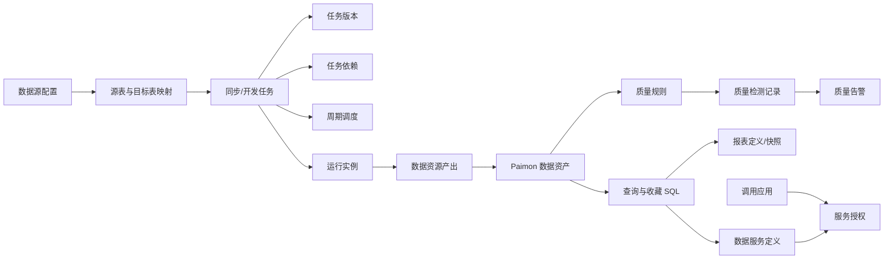
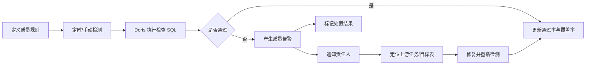
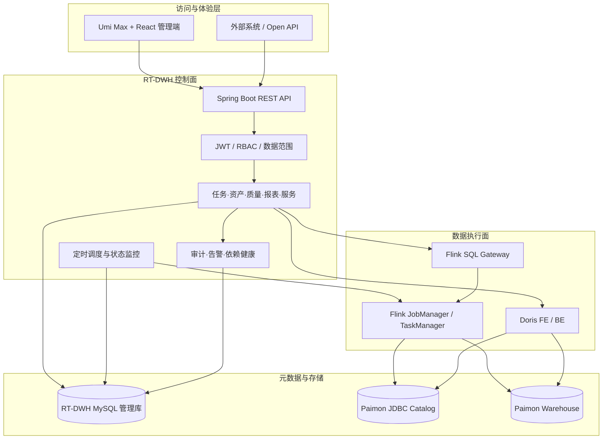
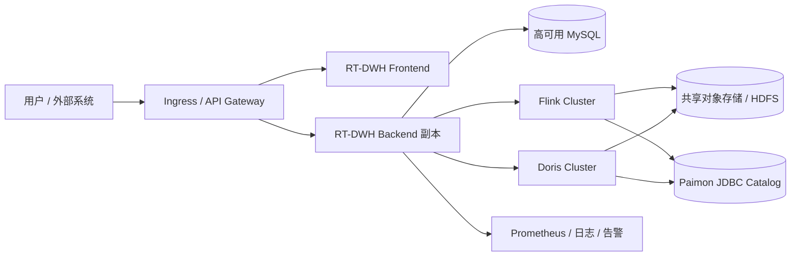

# RT-DWH 产品设计与技术方案

> 本文是 RT-DWH 的产品与技术总纲，用于统一产品范围、页面信息架构、核心对象、业务闭环、系统边界和工程实现。具体安装参数以根目录 `README.md` 为准，未完成事项以 `docs/product-roadmap.md` 为准。

## 1. 产品定义

### 1.1 一句话定位

RT-DWH 是面向中小数据团队的轻量实时数仓控制面：使用 **Flink 2.x 负责实时采集与计算、Paimon 负责湖仓存储、Doris 负责 Paimon 交互式查询**，平台负责接入、开发、资产、质量、服务、运维和权限治理。

### 1.2 目标问题

平台优先解决以下问题：

1. 业务库接入、Flink CDC SQL 和作业生命周期分散，创建与故障恢复成本高；
2. Paimon 中的数据缺少统一资产目录、责任人、分层和维护入口；
3. 使用 Flink 执行交互式查询会与常驻 CDC Job 争抢资源，查询体验不稳定；
4. SQL、报表、周期数据资源和外部接口之间缺少从开发到交付的产品闭环；
5. 质量、告警、SLA、审计和权限散落在各模块，无法形成治理视图；
6. 小团队没有专职平台研发，也需要可部署、可观测、可恢复的生产基础能力。

### 1.3 产品原则

- **控制面与数据面分离**：RT-DWH 管理状态和策略，不替代 Flink、Paimon、Doris 的执行内核。
- **写入与查询分离**：Flink 持续写入 Paimon，Doris 只读查询 Paimon，避免交互负载影响 CDC。
- **元数据驱动**：数据源探测、任务生成、资产发现、SQL 提示、质量和血缘围绕同一批元数据组织。
- **一个平台一个湖仓目录**：业务源连接按需创建，Paimon Catalog 与 Warehouse 作为平台级基础设施统一配置。
- **定义、实例与作业分离**：任务描述“做什么”，发布版本冻结“按哪份定义做”，实例记录“一次执行”，Flink Job 只代表执行载体。
- **闭环优先**：每项能力至少包含配置、执行、状态回写、异常处理和审计，而不只提供表单。
- **服务端强校验**：权限、数据范围、只读 SQL、限流和阈值不能只依赖前端控制。
- **渐进式部署**：开发环境可用 Docker Compose 一键启动，生产环境接入外部高可用基础设施。

### 1.4 产品边界

RT-DWH 当前不承担以下职责：

- 自研流批计算、湖仓格式或 MPP 查询内核；
- 替代通用 BI、自助取数和复杂可视化分析平台；
- 在控制面内实现所有数据源 Connector 或所有计算 Runner；
- 通过单机 Compose 模拟生产级 Flink、Doris 和对象存储高可用；
- 绕过 Doris／存储层权限，仅依靠前端隐藏菜单保护数据。

## 2. 用户与使用场景

| 用户角色 | 核心目标 | 高频任务 | 主要页面 |
|---|---|---|---|
| 数据工程师 | 让业务数据稳定进入 Paimon | 配置数据源、生成 CDC、发布任务、Savepoint、恢复失败 | 数据源配置、任务管理、任务详情 |
| 数据开发 | 加工并按时交付数据 | 编写 SQL、配置 DAG、发布版本、定时产出、补数 | 任务编排、即席查询、表管理 |
| 数据分析师 | 查询和消费可信数据 | 搜索资产、验证口径、下载数据、制作报表 | 公共能力、即席查询、报表看板 |
| 数据治理人员 | 提升资产可理解性和质量 | 维护分层与责任人、规则检测、风险处置、血缘分析 | 表管理、数据质量、数据血缘 |
| 数据平台运维 | 保证任务和依赖稳定 | 查看健康、告警、Lag、Checkpoint、失败实例和审计 | 数据总览、告警管理、系统设置、操作审计 |
| 外部系统开发者 | 稳定调用数据能力 | 申请应用凭证、按授权调用参数化接口 | 数据服务、开放 API |
| 平台管理员 | 管理人员、权限和平台配置 | 用户角色、数据范围、密钥、配额和运行参数 | 用户与权限、系统设置、操作审计 |

## 3. 产品信息架构

```text
实时数仓平台
├── 数据总览              平台运行状态、任务与质量摘要
├── 公共能力              统一检索、权限、SLA、可观测、审计治理
├── 同步任务
│   ├── 任务管理          CDC／ETL／物化任务与运行操作
│   ├── 任务编排          DAG、版本、补数、实例和周期调度
│   └── 数据源配置        业务源连接、测试、Schema 探测和配置模板
├── 数仓管理
│   ├── 表管理            Paimon 资产、Schema、Snapshot 和治理属性
│   ├── 数据血缘          表级上下游关系和影响分析
│   └── 表维护            Compact、Snapshot 和孤儿文件维护
├── 数据质量              健康指标、分层统计、规则、检测和告警闭环
├── 查询与报表
│   ├── 即席查询          Doris 加速 Paimon 查询、下载和历史
│   ├── 报表看板          参数化报表、快照、调度和分发
│   └── 数据服务          周期数据资源与外部参数化 API
└── 告警与系统
    ├── 告警管理          规则评估、通知和恢复
    ├── 系统设置          Flink／Doris／Paimon 参数与连接健康
    ├── 用户与权限        RBAC 和 Catalog／Database／Table 数据范围
    └── 操作审计          写操作、失败操作和变更追溯
```

页面组织遵循三个层次：顶部指标回答“现在是否健康”，列表与筛选回答“问题在哪里”，操作和详情回答“下一步怎么处理”。

## 4. 核心领域对象



| 对象 | 关键属性 | 生命周期关注点 |
|---|---|---|
| 业务数据源 | 类型、连接、凭证、额外配置 | 创建、测试、探测、停用、密钥轮换 |
| 平台湖仓配置 | Paimon Catalog、Metastore、Warehouse | 系统设置、连通检查、密钥轮换、备份恢复 |
| 同步／开发任务 | 执行模式、类型、SQL、映射、并行度、Checkpoint | 草稿定义与持续 Job 状态分别管理 |
| 任务版本 | 版本号、不可变配置快照、发布人 | 发布、比较、回滚到草稿、切换当前发布版本 |
| 运行实例 | 定义版本、业务日期、批次、参数、执行器、租约、重试 | waiting、queued、running、success、failed、cancelled |
| 数据资源 | Catalog、Database、Table、分层、负责人、SLA | 声明、产出、质量门禁、可用、blocked、逾期 |
| 数据资产 | Schema、主键、分区、Snapshot、治理属性 | 同步、补充治理信息、维护、下线 |
| 质量规则 | 维度、字段、表达式、阈值、启用状态 | 创建、检测、失败、告警、处置 |
| 报表 | SQL 模板、参数、图表、调度、订阅 | draft、发布、运行、快照、分发 |
| 数据服务 | 服务编码、SQL 模板、参数、限额、状态 | 创建、授权、发布、调用、停用、审计 |
| 用户与角色 | 角色、权限码、数据范围 | 创建、授权、启停、密码重置、审计 |

### 4.1 可扩展任务场景与执行模型

任务管理将“用户选择的产品场景”和“后端执行适配器”解耦：

```text
场景编码 scenarioCode              执行模式 executionMode
    ├── table_realtime_sync ─────┐
    ├── database_realtime_sync ──┼──> cdc_sync ───────> continuous
    ├── sql_transform ───────────────> etl ────────────> continuous
    ├── materialized_table ──────────> materialized ───> continuous
    └── scheduled_sql_output ────────> etl ────────────> scheduled
```

- `scenarioCode` 用于产品展示、表单路由、统计和后续能力开关；
- `taskType` 只用于选择 Flink 提交方式、入口类和运行生命周期；
- `executionMode` 决定产品闭环：`continuous` 走 Flink Job 生命周期，`scheduled` 走发布版本、调度和实例生命周期；
- 多个业务场景可以复用同一个执行适配器，新增场景不再要求同步增加后端枚举；
- 场景注册项统一声明分类、适用数据源、目标类型、输入方式、默认参数、开放状态和专属配置面板；
- 只有出现新的执行机制时才扩展 `taskType`，例如未来独立的 Kafka Runner 或文件采集 Runner。

当前场景规划：

| 场景 | 状态 | 执行适配器 | 创建体验 |
|---|---|---|---|
| 表级实时同步 | 已开放 | `cdc_sync` | 选表后自动生成 ODS 映射和 CDC SQL |
| 整库实时同步 | 已开放 | `cdc_sync` | 自动选择当前源库全部表，可排除后批量生成映射 |
| Flink SQL 加工 | 已开放 | `etl`／持续 | 填写 SQL，由 Flink Job 持续执行 |
| 物化表任务 | 已开放 | `materialized`／持续 | 填写物化表定义并持续维护结果 |
| 定时数据产出 | 已开放 | `etl`／周期 | 发布版本后配置依赖、Cron、补数和产出登记 |
| Kafka 实时入湖 | 已预留 | 待复用或新增 | 增加 Kafka 数据源、Topic 与 Schema 配置面板 |
| 文件批量入湖 | 已预留 | 待新增／周期 | 增加对象存储、目录、格式与去重配置面板 |

接入新场景的标准步骤是：注册场景元数据 → 配置数据源约束 → 接入专属表单 → 复用或实现执行适配器 → 增加创建与运行验收用例。规划中场景可以提前出现在产品入口，但必须明确标识且不可误提交。

## 5. 核心产品闭环

### 5.1 实时接入闭环


产品验收点：用户不进入 Flink 容器编写 SQL，也能完成配置、发布、验证和故障恢复。

### 5.2 数据开发与周期产出闭环

1. 创建“定时数据产出”周期任务并维护 SQL；
2. 配置上下游依赖，平台执行 DAG 环路检查；
3. 发布不可变任务版本，配置 Cron、时区、业务日期偏移和参数；草稿变更不替换当前发布版本；
4. 调度器创建实例；有依赖的实例等待同业务日期上游成功；
5. Runner 通过租约领取实例、回写 Job ID、发送心跳并完成执行；
6. 成功后登记产出记录；启用质量门禁时先运行目标表规则；
7. 通过门禁的数据登记为可用资产，失败数据标记为 `blocked`；
8. SLA 风险进入公共能力治理和告警视图。

### 5.3 查询、下载与报表闭环

1. 从 Doris Paimon Catalog 树选择 Database、Table 和 Column；
2. Monaco 编辑器根据当前上下文提供 SQL 提示；
3. 服务端执行只读校验、数据范围校验、并发排队、超时和最大行数限制；
4. Doris 执行查询并返回结果、Query ID、扫描量、CPU、内存和 Trace ID；
5. 用户下载 CSV 或收藏 SQL；
6. 将稳定 SQL 配置为类型化参数报表，发布到看板；
7. 报表按计划生成快照并通过邮件、钉钉或企业微信分发摘要。

### 5.4 外部数据接口闭环

1. 将经过只读校验的 Doris SQL 发布为参数化数据服务；
2. 创建调用应用，一次性签发 AppKey／AppSecret；
3. 按应用授权具体服务并设置服务状态；
4. 外部请求完成应用鉴权、参数校验、数据范围校验、限流和查询；
5. 返回标准结果并记录来源 IP、耗时、行数、状态和错误；
6. 支持密钥轮换、应用停用和调用审计。

### 5.5 数据质量治理闭环



质量页展示质量健康分、最新通过率、规则启用率、检测覆盖率、覆盖表数、未解决告警、分层质量、近 7 天趋势和待处理风险。综合分用于发现治理缺口，不代替具体门禁结果。

## 6. 能力范围与成熟度

| 产品域 | 当前可交付能力 | 下一阶段重点 |
|---|---|---|
| 数据接入 | MySQL／PostgreSQL、Schema 探测、CDC SQL、全量＋增量、作业生命周期 | PostgreSQL 特有类型回归、更多 Connector |
| 数据开发 | DAG、版本、补数、周期实例、内置 Flink SQL Runner、租约与重试 | 批次级暂停、日志聚合、更多 Runner |
| 资产管理 | Paimon 表／列／Snapshot、治理属性、表级血缘、湖仓维护 | 列级血缘、敏感字段和生命周期策略 |
| 查询治理 | Doris 查询、下载、收藏、取消、历史、并发和成本指标 | 慢因自动归因、跨用户容量运营 |
| 报表 | 参数化、发布、快照、调度、重试和摘要分发 | 附件、品牌模板、签名下载 |
| 数据服务 | 参数化 API、应用凭证、服务授权、限流和调用日志 | 分布式限流、HMAC／OAuth2、IP 白名单 |
| 数据质量 | 规则、定时检查、运行记录、健康指标、分层统计和告警处置 | 新鲜度趋势、规则模板、影响分析 |
| 平台治理 | RBAC、数据范围、审计、公共能力治理和依赖健康 | 审批发布、Doris 原生授权同步 |

详细未完成项和验收标准见 [产品路线图](product-roadmap.md)。

## 7. 产品指标设计

产品指标分为平台运行指标、数据交付指标和用户使用指标。当前页面已经覆盖主要运行数据，趋势化和运营报表作为后续增强。

| 指标类别 | 建议核心指标 | 计算口径 |
|---|---|---|
| 接入稳定性 | CDC 运行成功率、Checkpoint 成功率、最大 Lag | 活跃任务和指定统计周期内运行记录 |
| 开发交付 | 实例成功率、准时产出率、平均恢复时间 | 任务实例、产出记录和 SLA 截止时间 |
| 数据质量 | 最新通过率、检测覆盖率、告警解决率 | 启用规则的最新检测与质量告警 |
| 查询体验 | 查询成功率、P95、排队时间、预算超限率 | 查询历史和 Doris 运行指标 |
| 服务稳定性 | API 成功率、P95、限流次数、调用量 | 数据服务调用日志 |
| 治理覆盖 | 有责任人资产比例、有规则资产比例、审计失败数 | 资产、规则和操作审计 |
| 用户采用 | 周活用户、活跃开发者、SQL／报表／服务发布量 | 用户行为和业务对象变更 |

## 8. 总体技术架构



### 8.1 架构分层

| 层次 | 代码位置 | 主要职责 |
|---|---|---|
| 前端体验层 | `frontend/src/pages`、`frontend/src/app.tsx` | 页面、权限可见性、交互状态和 API 调用 |
| API 接入层 | `backend/.../controller` | 参数接收、权限码、统一响应和资源路由 |
| 领域服务层 | `backend/.../service` | 任务、查询、质量、报表、数据服务和治理规则 |
| 调度与监控层 | `backend/.../job` | 任务触发、依赖释放、Runner、质量、报表、告警和健康检查 |
| 持久化层 | `entity`、`repository`、`db/migration` | 管理状态、运行记录、审计和数据库版本演进 |
| 外部集成层 | Flink REST、SQL Gateway、Doris JDBC／HTTP、Paimon JDBC Catalog | 作业提交、SQL 执行、指标采集和元数据访问 |

### 8.2 控制面与数据面

- **控制面数据**进入 `rtdwh_mgmt`：用户、权限、任务配置、运行实例、规则、告警、报表、服务、审计和健康快照。
- **Paimon Catalog 元数据**进入独立 JDBC Catalog 数据库；RT-DWH 不把管理库当作 Paimon Catalog。
- **业务数据文件**进入 Paimon Warehouse；生产环境应使用所有 Flink 与 Doris 节点均可访问的共享存储。
- **交互查询**统一走 Doris FE MySQL 协议；Doris 通过 External Catalog 读取 Paimon 元数据与 Snapshot。

### 8.3 Paimon 存储层级与分层方案

Paimon 的“存储层级”和数仓的“业务分层”是两个正交概念：

```text
JDBC Catalog（Schema 与文件指针）
  → 共享 Warehouse（业务数据和元数据文件）
    → Database（ods / dwd / dws / ads 逻辑分层）
      → Table
        → Partition / Bucket
          → Snapshot → Manifest List → Manifest → Data / Index / Changelog File
```

平台级只配置一个 Catalog Key、一套 JDBC Metastore 和一处共享 Warehouse。Flink 写入、RT-DWH 元数据同步和 Doris External Catalog 必须引用这套统一配置；不得为每个同步任务或数仓层级重复创建 Warehouse。

| 分层 | 目标 | 数据组织 | 推荐写入方式 | 消费边界 |
|---|---|---|---|---|
| ODS | 保留源语义和可追溯明细 | 与源表结构接近，保留来源和采集时间 | 完整 CDC 输入写入主键表；创建时间或稳定业务日期分区 | 不承载跨域公共口径 |
| DWD | 形成可信原子事实 | 清洗、去重、标准编码、统一主键 | 主键 Upsert；按 Doris 兼容性和读写负载评估 MOR／MOW | 向多个 DWS／明细分析复用 |
| DWS | 沉淀公共主题汇总 | 轻度聚合、公共宽表和可复用指标中间结果 | 增量聚合或周期覆盖；通常按业务日期分区 | 不绑定单个前端页面 |
| ADS | 服务明确消费场景 | 报表、接口和应用专用结果 | 查询导向，可由 DWD／DWS 稳定重建 | 数据 API、看板和导出 |

生命周期策略必须拆开配置：

- **快照保留**用于 Time Travel、长查询和流任务恢复。Expire Snapshots 只物理删除不再被保留快照引用的历史文件；保留过少可能使长查询或历史恢复失败。
- **业务数据保留**用于删除到期分区／记录，不能通过“保留最近 N 个快照”替代，应建立独立的分区生命周期规则、审批和审计。
- **长期审计节点**使用 Tag 固化。Tag 保护其引用的 Manifest 与数据文件，适合在日常快照过期之外保留日／月级历史。
- **文件布局**由 Compact 策略治理。Minor Compact 用于日常小文件合并；Full Compact 会产生较大重写开销，应基于文件数、读放大和维护窗口触发。

## 9. 关键技术链路

### 9.1 CDC 写入与实时可见

```text
业务数据库 Binlog/WAL
  → Flink CDC Source
  → Flink 变更流与 Checkpoint
  → Paimon Commit / Snapshot
  → Doris Paimon External Catalog
  → SQL、报表和数据 API 可见
```

“实时可见”不是未提交数据的逐行直读。可见延迟约为一个 Checkpoint 提交周期加 Doris 查询时间。Doris 的 Paimon table-object 缓存默认关闭，以优先读取最新 Snapshot。

### 9.2 Doris 查询治理

查询服务执行顺序：

1. 解析 SQL 并拒绝写操作、多语句和不安全结构；
2. 解析物理表，校验当前用户 Catalog／Database／Table 数据范围；
3. 获取用户并发配额，必要时进入短时公平队列；
4. 设置 Catalog、Database、查询超时、内存和 Workload Group；
5. 执行 SQL，限制返回行数并支持取消；
6. 采集 Doris Query ID、扫描量、CPU、峰值内存和 Profile；
7. 持久化查询历史、成本分、预算标记、Trace ID 和错误。

### 9.3 工作流执行一致性

- 调度创建实例时使用任务、业务日期和批次构成幂等约束；
- 每个实例写入 `definitionVersionId`，Runner 只读取该不可变快照，不读取任务当前草稿；
- 上游依赖按相同业务日期检查，避免跨批次错误释放；
- 执行器通过数据库锁原子领取实例，并写入租约和 `executorId`；
- 运行中持续发送心跳，租约过期的实例可被回收；
- 失败按 `next_retry_at` 和指数退避重新入队；
- 成功回写与数据产出登记在服务端组织，避免前端决定产出状态；
- 取消、重跑和回滚均保留原运行与版本记录。

### 9.4 权限与数据安全

```text
JWT 身份
  → 角色与接口权限码
  → Controller 方法级授权
  → Catalog/Database/Table 数据范围
  → SQL 物理表校验
  → 查询、报表、数据服务执行
  → 操作审计 / 调用日志
```

- 内置角色提供默认权限，自定义角色无数据范围时默认拒绝；
- 前端菜单和按钮按权限展示，但最终授权以服务端为准；
- 数据范围统一约束 SQL 查询、任务可见性与产出、质量规则和记录、报表及治理中心汇总，避免跨模块旁路；
- 数据源密码加密存储，AppSecret 只在创建或轮换时返回一次；
- 非只读管理操作进入操作审计；开放接口独立记录调用日志；
- 生产环境建议进一步映射 Doris 原生用户、角色和行列权限，形成纵深防御。

## 10. 可靠性、性能与可观测性

### 10.1 故障隔离

- Doris 或 Flink 暂时不可用时，控制面仍应可登录并展示依赖故障；
- Flink 状态轮询区分任务真实结束和集群不可达，避免误改任务状态；
- Doris 连接使用独立连接池、连接超时和查询超时；
- 查询并发、返回行数、导出行数、内存和成本预算均可配置；
- 告警按对象去重，指标恢复后自动关闭并发送恢复通知；
- 定时任务使用固定延迟和幂等数据约束，避免多次扫描产生重复业务记录。

### 10.2 可观测数据

| 对象 | 关键可观测数据 |
|---|---|
| Flink Job | 状态、Job ID、Checkpoint、Savepoint、Lag、吞吐、错误 |
| 工作流实例 | 状态、业务日期、执行器、租约、重试、耗时、失败原因 |
| Doris 查询 | Query ID、Trace ID、排队、扫描量、CPU、内存、Profile、错误 |
| Paimon 资产 | Snapshot、文件量、Schema、分区、维护记录 |
| 数据质量 | 检测批次、规则实际值、阈值、耗时、告警与处置状态 |
| 数据服务 | 应用、服务、来源 IP、状态码、行数、耗时、错误 |
| 依赖组件 | MySQL、Flink、Doris、Paimon Catalog 健康快照 |

### 10.3 建议验收基线

以下是上线验收目标，不代表当前仓库已经完成同等规模压测：

| 维度 | 建议目标 |
|---|---|
| 控制面可用性 | 单实例开发环境可恢复；生产采用至少 2 个无状态后端副本并外置调度协调 |
| CDC 可见延迟 | 正常情况下不超过 Checkpoint 周期加查询时间 |
| 调度触发偏差 | 不超过一次调度扫描间隔，默认约 10 秒 |
| 查询保护 | 每用户并发、排队等待、超时、内存、最大行数全部生效 |
| 实例可靠性 | 重复触发不产生重复实例；执行器失联后租约可回收 |
| 审计完整性 | 生产写操作、权限变更、服务调用均可追溯到主体和结果 |
| 备份恢复 | 管理库、Paimon Catalog 和 Warehouse 分别具备备份与恢复演练 |

## 11. 部署方案

### 11.1 开发与验收环境

Docker Compose 提供 MySQL、PostgreSQL、Flink、SQL Gateway、Doris、RT-DWH 前后端和可选 Prometheus／Grafana。Paimon Warehouse 使用本地共享卷，仅用于单机开发与验收。

### 11.2 生产环境



生产部署要求：

- Helm Chart 只部署 RT-DWH 前后端；MySQL、Flink、Doris 和共享存储由外部集群提供；
- 所有密钥通过 Secret 或外部密钥系统注入，不写入镜像和 Git；
- Warehouse 必须对 Flink、Doris 全部节点使用一致路径或一致对象存储 URI；
- 多后端副本场景需要验证调度任务互斥、数据库锁和 Quartz 集群配置；
- 外部数据接口的多副本限流应迁移到 Redis 或 API Gateway；
- 对管理库、Paimon Catalog 和 Warehouse 分别制定备份、保留和恢复策略。

## 12. 技术决策与取舍

| 决策 | 选择 | 原因 | 代价／约束 |
|---|---|---|---|
| Paimon 查询引擎 | Doris | 隔离 Flink CDC 资源，提供低延迟并发查询与 Profile | 需要维护 External Catalog 和版本兼容性 |
| Paimon Catalog | MySQL JDBC Catalog | 部署轻量、便于 Flink 与 Doris 共享 | Catalog 数据库需要高可用和独立备份 |
| 管理后端 | Spring Boot + JPA | 团队常见技术栈，适合控制面和事务状态 | 复杂分析不应直接压管理库 |
| 作业集成 | REST + SQL Gateway | 不把 Flink 客户端生命周期嵌入 Web 进程 | Gateway 和 Connector 版本必须一致 |
| 权限模型 | 权限码 + 数据范围 | 同时解决“能做什么”和“能看哪些表” | 列级与 Doris 原生授权仍需增强 |
| 调度执行 | 控制面建实例 + Runner 领取 | 解耦调度与计算引擎，支持外部 Runner | 需要租约、心跳、幂等和回收机制 |
| 数据服务 | SQL 模板 + 类型化参数 | 从已验证 SQL 快速形成接口 | 不等同于通用 API 编排或复杂服务开发平台 |

## 13. 演进路线

### 当前阶段：核心闭环可用

- 已形成 CDC → Paimon → Doris 查询链路；
- 已形成任务编排、周期产出、质量门禁和资产登记；
- 已形成查询下载、报表调度和外部数据 API；
- 已具备质量治理、公共能力、权限、审计和依赖健康入口。

### 下一阶段：生产强化

1. PostgreSQL 特有类型与 Slot 生命周期回归；
2. 最小 Kubernetes 集群安装、升级和回滚验收；
3. 多副本调度互斥、分布式限流和高可用演练；
4. 查询慢因、成本归因、SLA 趋势和值班运营；
5. 报表附件、签名链接和分发模板。

### 后续阶段：治理深化

1. 列级血缘、敏感字段、脱敏和 Doris 行列授权；
2. 统一指标、维度、口径版本和消费关系；
3. 数据源、生产任务、质量规则和权限变更审批；
4. 容量预测、存储成本和跨团队数据产品运营。

## 14. 文档维护约定

- 产品范围、用户闭环或架构边界变化时，优先更新本文；
- 安装命令、环境变量和故障处理更新 `README.md`；
- 当前已完成建设和运行约定更新 `platform-construction.md`；
- 缺口、优先级和验收标准更新 `product-roadmap.md`；
- API 字段变化应同步 OpenAPI／接口设计与前端类型定义；
- 文档中“已完成”必须能够映射到页面、API、执行链路和可重复验证方式。
